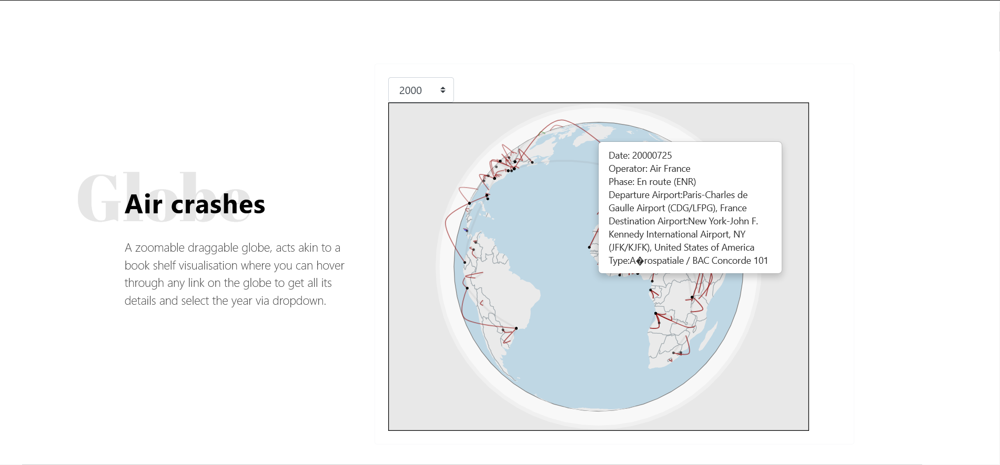
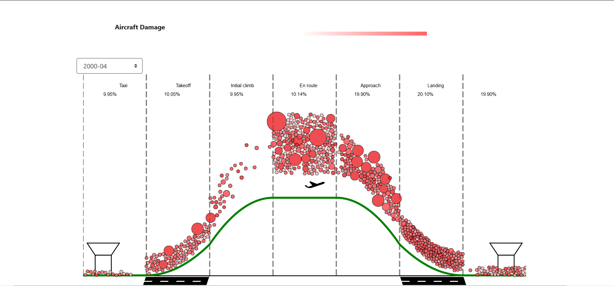
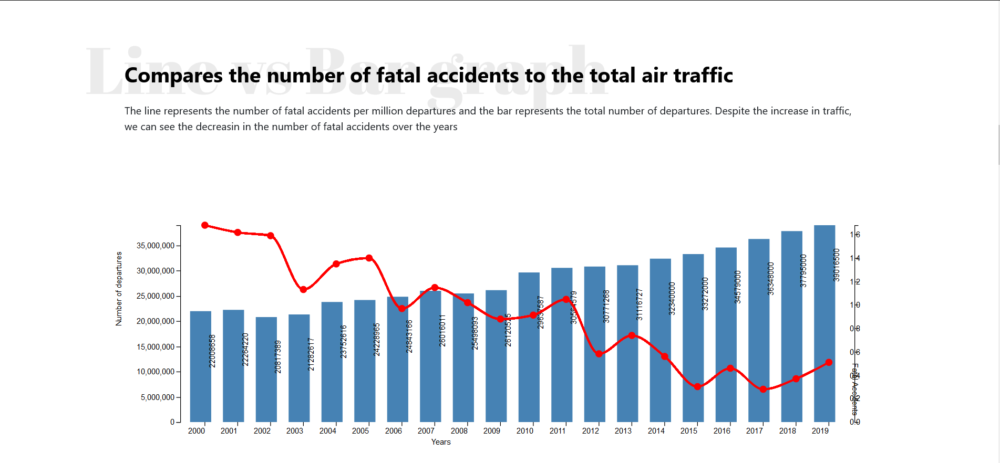
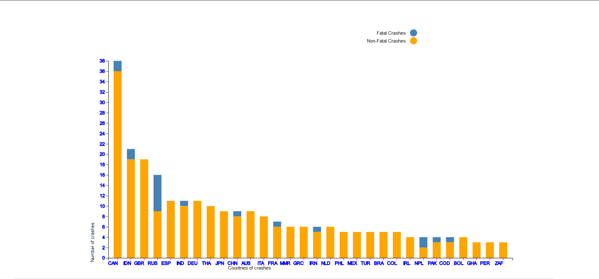
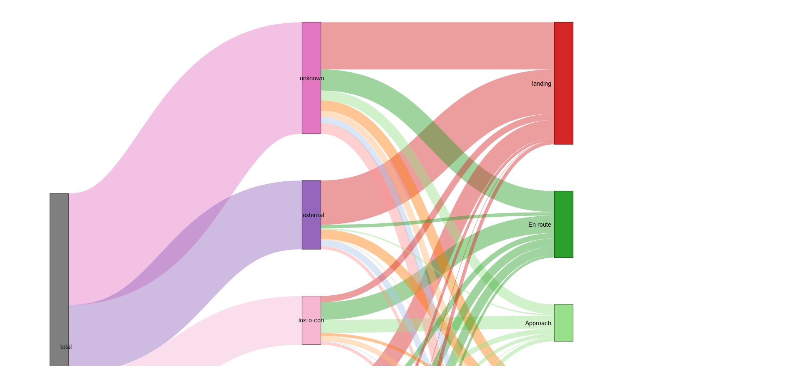
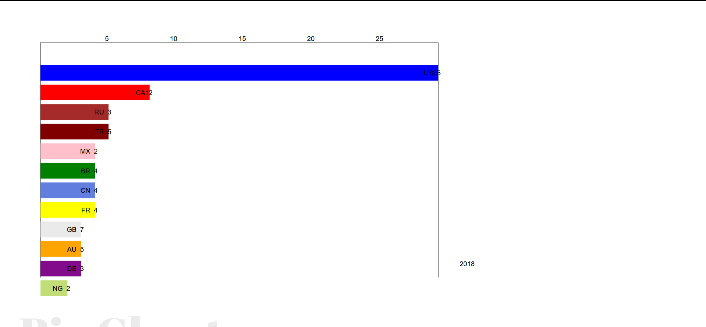
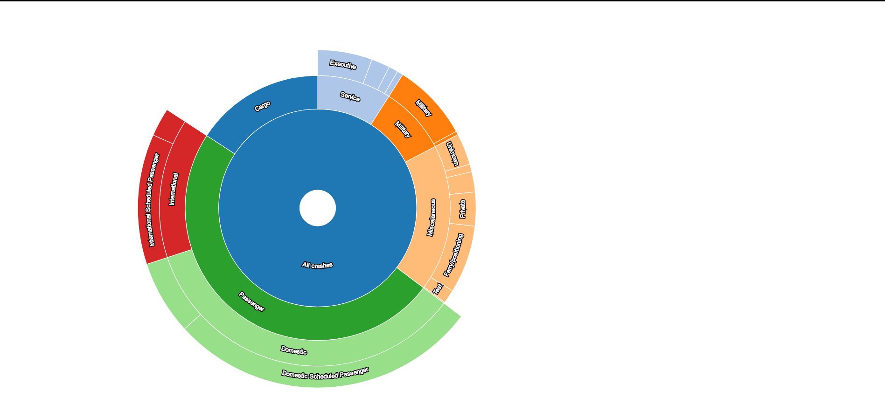

# Air Accidents Visualizer
Visualising all aviation accidents from 2000 to 2018 using **D3.js** . 

Done by Bhavyajeet Singh, Vikrant Dewangan as part of the Data Visualization Course (Spring,2020).
## Objective
Data Visualization is a very powerful tool to capture the audiences. It has the potential to reveal certain details hidden to the norma eye. With Aviation being a booming industry and a lots at stake, it becomes necessary to analyze the happenings and reasons to why an incident has occured. We have tried to collect aviation related incidents from the year 2000 uptill 2018, with drawing visualizations corresponding to each useful relation amongst the attributes.

## Build
After cloning the repo, just run a local server - 
``` 
$: php -S localhost 8080
```

## Visualizations Used

| Type  | Screenshots | Purpose |
| ------------- | ------------- | ------------- |
| 3D Globe Visualization  |   | Serves as a bookshelf visualisation for user to view all accidents at a glance |
| Scatter Chart for Phase Visualisation  |  | Amount vs intensity of crashes at each phase. Crashes at the En-Route Phase are the most fatal. |
| Barline Chart for Timeline  |  | Trends of Air Crashes vs Departure that have occured with time. |
| Stacked Bar Chart for Countries  |  | Countries vs Air Crashes and Fatal/ Non-Fatal Crashes. |
| Sanky Chart for Phase vs Cause  |  | Trends of Phase vs Cause that have occured. Hijacking can be seen mostly in En-Route Phase. |
| Bar Race Chart for Overall Fatalities Countrywise  |  | Trends of Country vs Fatalities yearwise. |
| Pie Chart for Type of Air Crashes  |  | Trends of Air Crashes vs Type of Crahes that have occured. |

## Data Sources
We have used the following websites for our data 
- Aviation Safety Database (https://aviation-safety.net/database/)
- ICAO Official Database (https://www.icao.int/safety/iStars/Pages/API-Data-Service.aspx)

## Libraries Used
The following libraries were used for extraction of data - 
- Cheerio.js (JavaScript)
- Node.Js (JavaScript)
- BeautifulSoup (Python)

